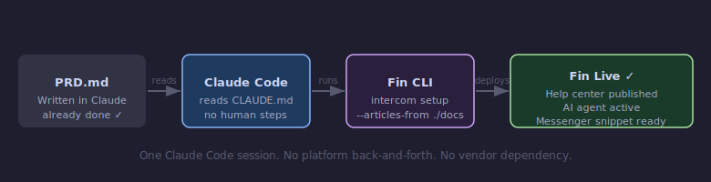
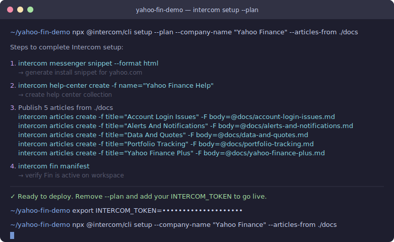
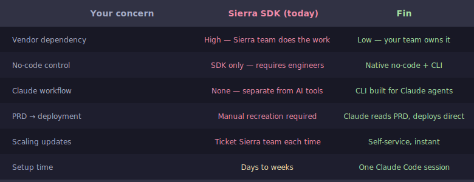

# Yahoo Finance — Fin AI Agent Demo

> *"I already have a PRD using another AI. Why do I have to come and do it on your platform again?"*
> — Yahoo Finance PM

This repo is the answer. A working example of going from a Claude-written PRD to a live Fin deployment in a single session — no manual setup, no platform back-and-forth, no vendor dependency.

---

## The flow



---

## What the CLI actually does



Every command above is real and executable. Add your `INTERCOM_TOKEN` and drop `--plan` to deploy.

---

## How it compares to your current setup



---

## What's in this repo

```
PRD.md          ← The only starting point. A Yahoo Finance CX brief written in Claude.
CLAUDE.md       ← Claude Code reads this and runs the full deployment autonomously.
docs/           ← 5 help articles generated from the PRD, ready to publish.
  account-login-issues.md
  alerts-and-notifications.md
  data-and-quotes.md
  portfolio-tracking.md
  yahoo-finance-plus.md
```

---

## Run it yourself (2 minutes)

**Step 1 — Authenticate**
```bash
export INTERCOM_TOKEN=your_token_here
```
Get your token: Intercom → Settings → Developers → Access Token

**Step 2 — Preview (no changes made)**
```bash
npx @intercom/cli setup --plan --company-name "Yahoo Finance" --articles-from ./docs
```

**Step 3 — Deploy**
```bash
npx @intercom/cli setup --company-name "Yahoo Finance" --articles-from ./docs
```

Fin is live.

---

## The agentic version (Claude Code)

Clone this repo and open it in [Claude Code](https://claude.ai/code). It reads `CLAUDE.md` automatically and will:

- Verify that the docs match the PRD scope
- Fill any gaps or update articles if the PRD changes
- Run the full deployment
- Output the messenger install snippet

The full flow — PRD to live Fin — in one Claude Code session, with no coding required.

---

## Why this matters for Yahoo Finance

Yahoo Finance's team already uses Claude to write PRDs. This demo shows that the same Claude session that produces the PRD can also deploy it — no recreation on another platform, no back-and-forth, no vendor doing the heavy lifting.

Your team owns the configuration. Updates happen in your tools, on your timeline.
